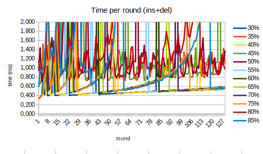
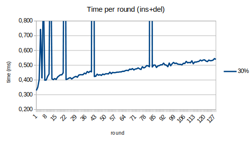
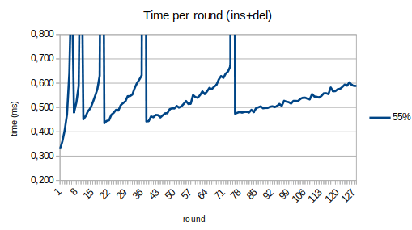
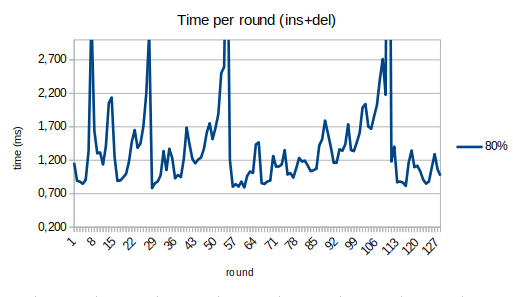

## Основные изменения

* Таблица из массива превращена в структуру. В таблицу добавлен счётчик загрузки, содержащий количество хранящихся в таблице ключей. Данный счётчик обновляется только при добавлении новых элементов в таблицу (в случае, если ключ не был найден), поэтому хранится в памяти GPU.
* Вместо фиксированного размера таблицу можно создавать с любой ёмкостью, переданной в качестве аргумента в функцию `create_hashtable()`. Текущая ёмкость также хранится в структуре таблицы.
* Добавлено динамическое изменение ёмкости (в сторону увеличения) с перевыделением памяти. Как только объём таблицы превышает порог `resize_thres`, определяемый при создании таблицы, перед вставкой создаётся новая таблица достаточного размера. Все имеющиеся данные перераспределяются в соответствии с новой функцией хэша. При копировании пропускаются ячейки, хранящие в поле данных `kEmpty` (удалённый мусор), что также позволяет освободить некоторое количество места. После перераспределения вставка продолжается.
* Добавлена новая функция теста. Данные вставляются блоками по 1/8 от начального размера таблицы, удаляются блоками по 1/16. В сумме вставляется в 16 раз больше данных, чем позволяет начальный размер. Время замеряется для сочетания вставки + удаления блока данных, называемых "раундом". Для каждого значения порога от 0.3 до 0.85 замерена зависимость производительности от номера "раунда", а также среднее время раунда и общее время обработки данных, также усреднённое по 5 итерациям.

## Результаты замеров

#### Время на раунд для всех значений `resize_thres`

...информативно.

#### Время на раунд для 30%, 55%, 80%

Хотя время раунда для порога в 30% остаётся низким и стабильным, выделяется слишком много памяти, а также учащаются изменения размера.

Оптимальный вариант - время растёт, но не превышает 0.7 мс, а перераспределения не отъедают слишком много времени, позволяя сохранять быстродействие.

Хотя количество перераспределений сократилось до 4, время доступа порой достигает 1/2 от времени **полного** перевыделения памяти с копированием таблицы, а также растёт "скачками", сильно завися от набора данных и количества мусора.

#### Среднее время на раунд

Среднее время 1 раунда за всё время работы. Из-за большого количества операций с удалением 30% выглядит довольно низким, но стоит помнить про большой объём неиспользуемой памяти.

#### Среднее суммарное время теста

Хорошо заметен долгосрочный проигрыш 30% и потери из-за нехватки памяти при больших значениях порога. А вот 50-60% остаются оптимальным результатом.
